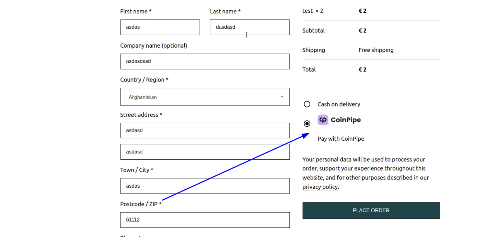

# coinpipe-wc-near-gateway
## Woocommerce coinpipe integration method

1) DOWNLOAD plugin from this repo and make sure that it has name coinpipe-wc-near-gateway (without-branch name like coinpipe-wc-near-gateway-master)

2) create your shop on coinpipe. Pay attention to callback link  

3) Activate plugins in wp-plugins tab
   
4) Enable payment method in woocommerce.
   
5) add configurations from your coipipe shop (step2)
   
6) Provide one of available currencies: USD, EUR, NEAR
   
7) The payment is on your checkout now
   